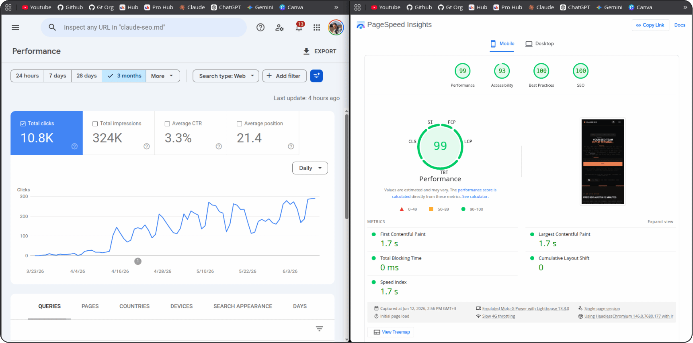

# Claude SEO × GEO — SEO + AEO Plugin for Claude Code

**A ZYRA-maintained distribution of an SEO analysis plugin for [Claude Code](https://claude.ai/claude-code), extended with a first-class Answer Engine Optimization (AEO/GEO) layer.** It runs 32 sub-skills and 20 specialist agents in parallel across technical SEO, content quality (E-E-A-T), Schema.org markup, AI crawler access, deterministic citability scoring, per-platform AI search optimization, and brand-mention tracking. Every audit produces a prioritized action plan with falsifiable recommendations, and SEO and AEO are always reported as **two separate scores** — never blended into one number.

[](https://github.com/toolsatZyra/-claude-seo-x-geo/actions/workflows/ci.yml)
[](https://claude.ai/claude-code)
[](LICENSE)
[](tests/)
[](https://growthzyra.com)

> **Provenance.** This plugin is a fork of [`AgriciDaniel/claude-seo`](https://github.com/AgriciDaniel/claude-seo) (MIT), grafted with the AEO/GEO modules from [`zubair-trabzada/geo-seo-claude`](https://github.com/zubair-trabzada/geo-seo-claude) (MIT). ZYRA maintains this distribution: we did the merge/integration work joining the two projects, then ran a dedicated accuracy-hardening pass over the AEO/GEO layer — correcting sourcing, fixing a live factual error in AI-crawler guidance, and removing unverifiable statistics (see [What's new in this fork](#whats-new-in-this-fork)). Full attribution: [NOTICE.md](NOTICE.md) and [CONTRIBUTORS.md](CONTRIBUTORS.md). Both original MIT licenses are preserved unmodified.

### Why this fork exists

- **AEO/GEO as a first-class, separately-scored dimension**, not a relabeling of SEO. A full audit reports SEO and AEO scores side by side, never blended.
- **Evidence discipline applied to the AEO layer itself.** Every precise AEO/GEO statistic in this fork traces to a named, checkable source in [`skills/seo-geo/references/evidence-registry.md`](skills/seo-geo/references/evidence-registry.md) — claim, source, retrieval date, and confidence level. Numbers we couldn't verify were removed rather than left uncorrected.
- **AI-search first.** Aligned with [Google's AI Optimization Guide](https://developers.google.com/search/docs/fundamentals/ai-optimization-guide) and verified against OpenAI's, live crawler documentation. Question-based citability scoring, primary-source evidence on llms.txt, agent-friendly page checks per [web.dev](https://web.dev/).
- **Parallel execution.** Full site audits spawn up to 15 specialist agents simultaneously. Site-level audits complete in minutes rather than hours.
- **Falsifiable, not promotional.** Every recommendation carries the first-principle observation it rests on, its dependency relationships, an explicit "how would we know this failed?" check, and a leading indicator. See [Methodology](#methodology).

### Real results



Google Search Console for a site started 23 March 2026 and run on this workflow: total clicks and impressions across its first three months, through 12 June 2026.

## Who this is for

- **SEO agencies running 5+ client sites.** Replace quarterly deep audits with weekly automated runs. Same team capacity, 4× audit cadence, every recommendation comes with a falsifiability check the client can verify.
- **In-house SEO leads at SaaS / publisher / e-commerce companies.** Second-pair-of-eyes before executive reviews. Catches what GSC and Lighthouse hide: schema deprecation, AI-citability gaps, expired-domain heritage risk, parasite-SEO exposure, machine-translation drift.
- **Freelance SEO consultants.** Anchor day-one client scope with a 15-minute audit and a real 0-100 score. Win the engagement with concrete proof of value before you spend an hour writing the proposal.


Run a full audit and watch parallel agents fan out across the site:


## Table of Contents

- [Who this is for](#who-this-is-for)
- [Installation](#installation)
- [Quick Start](#quick-start)
- [Commands](#commands)
- [Features](#features)
- [Compared to manual / agency / commercial tools](#compared-to-manual--agency--commercial-tools)
- [Use cases](#use-cases)
- [Sample Output](#sample-output)
- [Architecture](#architecture)
- [Methodology](#methodology)
- [What's new in this fork](#whats-new-in-this-fork)
- [Limitations](#limitations)
- [Requirements](#requirements)
- [Uninstall](#uninstall)
- [Extensions](#extensions)
- [Ecosystem](#ecosystem)
- [Documentation](#documentation)
- [FAQ](#faq)
- [Community Contributors](#community-contributors)
- [License](#license)
- [Contributing](#contributing)
- [Provenance & Credits](#provenance--credits)

## Installation

### Plugin Install (Claude Code 1.0.33+)

The fastest path. One-time marketplace add, then plugin install:

```bash
/plugin marketplace add toolsatZyra/-claude-seo-x-geo
/plugin install claude-seo@toolsatzyra-claude-seo-x-geo
```

### Manual Install (Unix / macOS / Linux)

```bash
git clone --depth 1 https://github.com/toolsatZyra/-claude-seo-x-geo.git
bash -claude-seo-x-geo/install.sh
```

<details>
<summary>One-liner (curl, review then run)</summary>

```bash
curl -fsSL https://raw.githubusercontent.com/toolsatZyra/-claude-seo-x-geo/main/install.sh > install.sh
cat install.sh        # review before running
bash install.sh
rm install.sh
```

</details>

### Windows (PowerShell)

```powershell
git clone --depth 1 https://github.com/toolsatZyra/-claude-seo-x-geo.git
powershell -ExecutionPolicy Bypass -File "-claude-seo-x-geo\install.ps1"
```

> **Why `git clone` instead of `irm | iex`?** Claude Code's own security guardrails flag `irm ... | iex` as a supply chain risk: downloading and executing remote code without verification. The `git clone` approach lets you inspect `install.ps1` before running it.

## Quick Start

```bash
# Start Claude Code
claude

# Full site audit: parallel sub-agents produce a prioritized action plan
/seo audit https://example.com

# Deep single-page analysis: on-page elements, content quality, schema
/seo page https://example.com/about

# Schema markup audit: detect, validate, generate
/seo schema https://example.com

# AI search optimization: passage citability + primary-source-aligned recommendations
/seo geo https://example.com

# Generate a sitemap with industry templates
/seo sitemap generate
```

## Commands



25 user-invocable `/seo` commands across the orchestrator and its sub-skills. Full reference in [docs/COMMANDS.md](docs/COMMANDS.md).

| Command | Description |
|---------|-------------|
| `/seo audit <url>` | Full website audit with parallel sub-agent delegation |
| `/seo page <url>` | Deep single-page analysis |
| `/seo technical <url>` | Technical SEO audit across 9 categories |
| `/seo content <url>` | E-E-A-T and content quality analysis |
| `/seo content-brief <topic>` | Detailed content brief: target keywords, outline, internal links |
| `/seo schema <url>` | Detect, validate, and generate Schema.org markup |
| `/seo geo <url>` | AI Overviews / Generative Engine Optimization router — fans out to the geo-* cluster |
| `/seo sitemap <url \| generate>` | Analyze or generate XML sitemaps |
| `/seo images <url>` | Image optimization analysis |
| `/seo plan <type>` | Strategic SEO planning (saas, local, ecommerce, publisher, agency) |
| `/seo programmatic <url>` | Programmatic SEO analysis and planning |
| `/seo competitor-pages <url>` | Competitor comparison page generation |
| `/seo local <url>` | Local SEO analysis (GBP, citations, reviews, map pack) |
| `/seo maps [command]` | Maps intelligence (geo-grid, GBP audit, reviews, competitors) |
| `/seo hreflang <url>` | Hreflang / i18n SEO audit and generation |
| `/seo google [command]` | Google SEO APIs (GSC, PageSpeed, CrUX, Indexing, GA4, PDF reports) |
| `/seo backlinks <url>` | Backlink profile analysis (Moz, Bing, Common Crawl) |
| `/seo cluster <keyword>` | SERP-based semantic clustering |
| `/seo sxo <url>` | Search Experience Optimization (page-type, user stories, personas) |
| `/seo drift baseline \| compare \| history <url>` | SEO drift monitoring with SQLite snapshots |
| `/seo ecommerce <url>` | E-commerce SEO and marketplace intelligence |
| `/seo flow [stage]` | FLOW framework prompts (CC BY 4.0, evidence-led) |
| `/seo firecrawl [command] <url>` | Full-site crawling (extension) |
| `/seo dataforseo [command]` | Live SEO data (extension) |
| `/seo image-gen [use-case]` | AI image generation for SEO assets (extension) |

The AEO/GEO cluster is a distinct set of `geo-*` skills routed through `seo-geo`: `geo-citability` (deterministic passage scoring), `geo-crawlers` (AI crawler access), `geo-platform-optimizer` (per-platform: Google AI Overviews, ChatGPT, Perplexity, Gemini, Bing Copilot), `geo-brand-mentions` (AI-cited platform presence), `geo-compare` (month-over-month AEO delta), `geo-prospect` / `geo-proposal` (agency sales workflow).

## Features

### What Core Web Vitals does this plugin check?

Measures the current three Core Web Vitals: **LCP** (Largest Contentful Paint, target under 2.5s), **INP** (Interaction to Next Paint, target under 200ms), and **CLS** (Cumulative Layout Shift, target under 0.1). [INP replaced FID](https://web.dev/articles/inp) on March 12, 2024; FID was removed from all Chrome tools (CrUX API, PageSpeed Insights, Lighthouse) on September 9, 2024, and this plugin never references FID. Field data comes from the Chrome User Experience Report (CrUX) when available; lab data falls back to Lighthouse via PageSpeed Insights. LCP can be decomposed into subparts (TTFB, load delay, load duration, render delay) via the `/seo google` CrUX integration to localize bottlenecks. Mobile and desktop are measured separately.

### How does this plugin assess E-E-A-T?

E-E-A-T (Experience, Expertise, Authoritativeness, Trustworthiness) is evaluated against the Search Quality Rater Guidelines, last updated September 2025 with YMYL expanded to include political and social topics. Experience signals: original research, case studies, first-hand photos. Expertise: author credentials and topical depth. Authoritativeness: external citations and brand mentions. Trustworthiness, the most heavily weighted of the four: contact info, secure HTTPS, transparent corrections, date stamps. Before scoring sub-factors, the plugin applies Google's own Who / How / Why heuristic from the [helpful-content guide](https://developers.google.com/search/docs/fundamentals/creating-helpful-content).

### What Schema.org types does this plugin support?

JSON-LD is the preferred format (Google's stated preference). Active types detected, validated, and generated: Organization, LocalBusiness, Article, BlogPosting, NewsArticle, Product, ProductGroup, Offer, Review, AggregateRating, BreadcrumbList, WebSite, WebPage, Person, ProfilePage, ContactPage, VideoObject, ImageObject, Event, JobPosting, Course, DiscussionForumPosting, Reservation, OrderAction, plus video and specialized types. FAQPage: Google stopped showing FAQ rich results for all sites on May 7, 2026; still useful as a supporting AI/entity signal, not for rich results. Deprecated and never recommended: HowTo (rich results removed September 2023), SpecialAnnouncement (July 2025), ClaimReview, VehicleListing, EstimatedSalary. Replacement guidance: [skills/seo-schema/references/deprecated-types-2024-2026.md](skills/seo-schema/references/deprecated-types-2024-2026.md).

### How does this plugin optimize for AI search?

AEO/GEO is treated as a first-class, separately-scored dimension, not a relabeling of SEO — a position this fork holds deliberately against Google's own framing that "AEO" and "GEO" are just rebranded SEO labels. Google's eligibility floor still applies (AI Overviews and AI Mode are grounded in the same ranking systems as classic Search; pages must be indexed and eligible for snippet display to appear in any AI feature), but this fork additionally measures citation-structure signals classic SEO doesn't: passage citability is scored deterministically via `scripts/citability_scorer.py` (self-contained answer blocks, front-loading, question-based heading hierarchy, attribution density — see [[evidence-registry]](skills/seo-geo/references/evidence-registry.md) for what's independently sourced vs. heuristic), AI crawler access via `geo-crawlers` (verified against each vendor's current documentation — GPTBot vs. OAI-SearchBot are correctly distinguished, since they control different things), and brand/entity presence via `scripts/brand_scanner.py`. A full `/seo audit` reports SEO and AEO as two separate scores — never blended into one number. llms.txt is audited and can be generated on request, but is reported as a forward-looking, low-confidence signal, not a current ranking or citation lever — see [skills/seo-geo/references/llmstxt-evidence.md](skills/seo-geo/references/llmstxt-evidence.md).

### Which Google SEO APIs does this plugin integrate with?

A 4-tier credential system lets you start with zero keys and add data as needed:

| Tier | Credentials | APIs Unlocked |
|------|------|------|
| 0 | API key | PageSpeed Insights, CrUX, CrUX History (25-week trends) |
| 1 | + OAuth or Service Account | + Search Console (queries, URL Inspection, sitemap status), Indexing API |
| 2 | + GA4 property config | + GA4 organic traffic, top landing pages, device / country breakdown |
| 3 | + Ads developer token | + Keyword Planner search volume and competition data |

PDF reports are generated via [WeasyPrint](https://weasyprint.org/) (A4 layout) with matplotlib charts at 200 DPI. Run `/seo google setup` for the credential wizard. All credentials live under `~/.config/claude-seo/` with `0o600` permissions; nothing is checked into the repo.

### How does this plugin handle local SEO?

Three layers. **Google Business Profile signals**: categories, hours, photos, posts, products, attributes. **NAP consistency** across citations: name, address, phone matched against major directories with deviation flagging. **Review intelligence**: rating trends, sentiment, response coverage. For multi-location businesses, a 30-page warning threshold and a 50-page hard stop prevent doorway-page violations (configurable). The `/seo maps` workflow adds geo-grid rank tracking, GBP profile auditing, and competitor radius mapping.

## Compared to manual / agency / commercial tools

| | Manual audit | Agency engagement | Commercial SEO audit tool | **This plugin** |
|---|---|---|---|---|
| **Time per audit** | 4-8 hrs senior SEO time | 1-3 weeks turnaround | 10-45 min crawl + report | **10-15 min** |
| **Cost** | High (billable hours) | $2k-$15k+ project | $99-$999/mo subscription | **Free plugin + Claude Code subscription** |
| **Repeatable** | Inconsistent across analysts | Inconsistent across engagements | Yes | **Yes, deterministic + scriptable** |
| **Output format** | Wall-of-findings PDF | Branded slide deck | Web dashboard, CSV exports | **Markdown + PDF + JSON, local files** |
| **Custom benchmarks** | Manual per analyst | Agency-specific frameworks | Vendor-fixed | **Edit local SKILL.md** |
| **Data leaves machine?** | No (your spreadsheet) | Yes (sent to agency) | Yes (uploaded to vendor) | **No, fully local by default** |
| **Lock-in** | None | High | High (data-exit friction) | **None. MIT, your files.** |
| **AEO/SEO separation** | Depends on analyst | Depends on agency seniority | Rarely separated at all | **Always reported as two distinct scores** |
| **Falsifiability per finding** | No | No | No | **Yes. Every recommendation carries a "how would we know this failed?" check + leading indicator** |

> Cost benchmarks: manual audit assumes a senior SEO consultant at typical agency billable rates; agency engagement based on common discovery/audit deliverable scopes; commercial-tool subscriptions reflect published mid-tier pricing across the SEO audit category. Your numbers may differ — this is a directional comparison, not a market survey.

## Use cases

**SEO agency lead running 10 client sites.** Replaces the quarterly "deep audit" ritual with a weekly Monday-morning `/seo audit` run per site. The drift baseline catches regressions between audits so the client conversation moves from "look at this snapshot" to "here is what changed this week."

**In-house SEO lead at a 50-person SaaS company.** Runs `/seo audit` before each quarterly business review. Catches items the platform UI buries: broken canonical chains on programmatic pages, schema deprecation, AI-citability gaps, expired-domain heritage on acquired blog assets.

**Freelance SEO consultant onboarding a new client.** Runs `/seo audit` on the discovery call. Anchors the engagement scope with a real 0-100 score and a falsifiability check on each recommendation.

## Sample Output

This plugin writes real markdown reports as its primary deliverable. Below is the first ~50 lines of a `/seo schema` audit, verbatim, to show the actual structure and grading format.

<details>
<summary><code>SCHEMA-REPORT.md</code>: first 50 lines of a real audit</summary>

```markdown
# Schema Markup Report: example.com/about

**URL:** https://example.com/about
**Date:** 2026-07-06
**Format Detected:** JSON-LD (3 blocks) | No Microdata | No RDFa

---

## Summary

| Metric | Value |
|--------|-------|
| **JSON-LD Blocks** | 3 |
| **Schema Types** | Organization, WebSite, SoftwareApplication |
| **Critical Issues** | 2 |
| **Warnings** | 5 |
| **Passed Checks** | 18 |
| **Overall Grade** | B+ (solid foundation, actionable gaps) |

---

## Existing Schema Validation

### 1. Organization (`@id: #organization`)

| Property | Value | Status | Notes |
|----------|-------|--------|-------|
| `@context` | https://schema.org | Valid | |
| `@type` | Organization | Valid | Active type |
| `@id` | https://example.com#organization | Good | Enables cross-referencing |
| `name` | Example Co | Valid | |
| `description` | Present, 200+ chars | Good | Descriptive and keyword-rich |
| `url` | https://example.com | Valid | Absolute URL |
| `logo` | ImageObject with @id, url, width, height, caption | Excellent | Well-structured |
| `foundingDate` | "2024" | Imprecise | Year-only accepted but ISO 8601 preferred |
| `areaServed` | "Worldwide" | Text | Works but `GeoShape` is more semantic |
| `contactPoint` | email + contactType | Valid | Consider adding `telephone` |
| `sameAs` | 5 social profiles | Good | GitHub, X, LinkedIn, YouTube, Reddit |
| `knowsAbout` | 6 topics | Good | Relevant topical signals |
```

</details>

Other audit outputs follow the same shape: `FULL-AUDIT-REPORT.md` (umbrella audit, with SEO and AEO reported as separate scores), `GEO-CITABILITY-SCORE.md` (AI-search readiness), `LOCAL-SEO-ANALYSIS.md` (GBP and citations), and a production PDF via WeasyPrint + matplotlib.

## Architecture



The plugin follows the [Agent Skills standard](https://docs.claude.com/en/docs/claude-code/skills) with a 3-layer architecture (directive, orchestration, execution). Skills and agents are auto-discovered from `skills/` and `agents/`. The orchestrator (`skills/seo/SKILL.md`) handles industry detection (SaaS, local, ecommerce, publisher, agency), parallel sub-agent dispatch up to 15 simultaneously, and synthesis through the [10-principle framework](#methodology) before emitting the action plan. The AEO/GEO layer is architecturally separate: `seo-geo` routes to the `geo-*` cluster as a distinct scored track, per `skills/seo-audit/SKILL.md`'s AEO fan-out. Full architecture: [docs/ARCHITECTURE.md](docs/ARCHITECTURE.md).

## Methodology



Every audit walks 10 principles grouped into four phases. Each emitted recommendation carries four fields: the first-principle observation it rests on, its dependency relationship to other recommendations, a "how would we know this failed?" check, and a leading indicator to monitor.

| Phase | Principles | What it does |
|---|---|---|
| **PERCEIVE** | OBSERVE (external) · OBSERVE (internal) · LISTEN | Collect raw signals; audit your own assumptions; read what the SERP, the brand voice, and the community actually say |
| **ANALYZE** | THINK · CONNECT (lateral) · CONNECT (system) | Reduce to first principles; find non-obvious cross-skill links; sequence into a dependency graph |
| **VALIDATE** | FEEL · ACCEPT | Pressure-test against UX, brand voice, operator capacity; surface falsifiability |
| **ACT** | CREATE · GROW | Ship the artifact; set the feedback loop for the next audit |

Full methodology: [skills/seo/references/thinking-framework.md](skills/seo/references/thinking-framework.md). The same evidence discipline now applies to the AEO layer's own claims — see the next section.

## What's new in this fork

This fork joins two upstream MIT projects and then hardens the combined AEO/GEO layer for accuracy:

- **Merge**: grafted `geo-seo-claude`'s 7 AEO/GEO skills (`geo-citability`, `geo-platform-optimizer`, `geo-brand-mentions`, `geo-crawlers`, `geo-compare`, `geo-prospect`, `geo-proposal`) into `claude-seo`'s base, rewired their scorers onto `claude-seo`'s SSRF-hardened fetcher, and de-duplicated 8 overlapping skills into their `seo-*` equivalents rather than shipping 40 overlapping modules. Full spec: [MERGE_SPEC](https://github.com/toolsatZyra/-claude-seo-x-geo) commit history.
- **Accuracy-hardening pass** (2026-07-06): an independent audit surfaced sourcing and factual problems in the AEO layer, which were then fixed and verified:
  - Corrected a live factual error in AI-crawler guidance — GPTBot and OAI-SearchBot were conflated (blocking GPTBot does **not** affect ChatGPT Search visibility; that's OAI-SearchBot's job). Verified against OpenAI's current crawler documentation.
  - Corrected citation attribution for the core GEO research citation (Aggarwal et al., ACM SIGKDD 2024) and removed statistics that could not be traced to any real source.
  - Fixed a wrong statistic in client-facing sales material (a Gartner prediction was misquoted).
  - Made `brand_scanner.py`'s automation status explicit after finding it returned hardcoded placeholder fields that were never actually computed.
  - Added [`skills/seo-geo/references/evidence-registry.md`](skills/seo-geo/references/evidence-registry.md): every precise AEO/GEO statistic in this fork now traces to a source, retrieval date, and confidence level.
  - Fixed two regex false-positives in `citability_scorer.py` that inflated scores on generic prose.
- Full commit-by-commit detail is in the repository history rather than restated here — nothing here is asserted without a corresponding commit.

## Limitations

Two real boundaries worth being upfront about.

**Heavy client-side hydration timing.** The headless renderer handles most SPAs out of the box (`--render auto` detects empty `<div id="root">` shells and switches to Playwright). Edge cases that still produce noisy findings: pages with hydration tied to scroll position past the fold, pages that fetch critical content after user interaction, race-condition-prone third-party widget mounts. For these, manually triggering the `seo-visual` subagent and comparing its Playwright snapshot to the raw-HTML subagents' findings is the recommended workflow.

**Local-only without enrichment.** The free tier does not call any external API and produces zero-network output. Adding Google API credentials unlocks real field data and live indexation status; without them, Core Web Vitals are lab estimates only. The AEO citability score is a deterministic heuristic, not a measurement validated against real AI-citation outcomes — see [the evidence registry](skills/seo-geo/references/evidence-registry.md) for exactly which figures are sourced vs. directional.

## Requirements

- Python 3.11+
- Claude Code CLI
- Optional: Playwright Chromium (auto-installed by `install.sh`) for SPA rendering and screenshots
- Optional: Google API credentials for enriched CWV / GSC / GA4 data (see `/seo google setup`)

## Uninstall

```bash
git clone --depth 1 https://github.com/toolsatZyra/-claude-seo-x-geo.git
bash -claude-seo-x-geo/uninstall.sh
```

<details>
<summary>One-liner (curl)</summary>

```bash
curl -fsSL https://raw.githubusercontent.com/toolsatZyra/-claude-seo-x-geo/main/uninstall.sh | bash
```

</details>

## Extensions

Optional MCP servers add live data to the audit pipeline. The plugin core works without any of them.

### DataForSEO

Live SERP data, keyword research, backlinks, on-page analysis, content analysis, business listings, AI visibility checks, and LLM mention tracking.

```bash
./extensions/dataforseo/install.sh   # requires DataForSEO account
/seo dataforseo serp best coffee shops
/seo dataforseo ai-mentions your brand
```

Full docs: [extensions/dataforseo/README.md](extensions/dataforseo/README.md).

### Firecrawl

Full-site crawling and URL discovery via the [Firecrawl](https://www.firecrawl.dev/) MCP server.

```bash
./extensions/firecrawl/install.sh
/seo firecrawl crawl https://example.com
```

### Ahrefs, SE Ranking, Profound, Bing Webmaster, Unlighthouse

- **Ahrefs:** official `@ahrefs/mcp` server with backlink and organic data
- **SE Ranking:** AI Share-of-Voice across ChatGPT, Gemini, Perplexity, AI Overviews, AI Mode
- **Profound:** LLM citation tracker with time-series data
- **Bing Webmaster:** Bing Webmaster Tools plus IndexNow unified
- **Unlighthouse:** MIT-licensed multi-page Lighthouse runner

Setup walkthroughs: [docs/MCP-INTEGRATION.md](docs/MCP-INTEGRATION.md).

## Ecosystem

This plugin builds on the upstream `claude-seo` / `geo-seo-claude` ecosystem:

| Project | What it does | Relationship |
|-------|-------------|-----------------|
| [claude-seo](https://github.com/AgriciDaniel/claude-seo) | Original SEO analysis base this fork builds on | Upstream. MIT. |
| [geo-seo-claude](https://github.com/zubair-trabzada/geo-seo-claude) | Original AEO/GEO modules this fork grafts in | Upstream. MIT. |
| [Codex SEO](https://github.com/AgriciDaniel/codex-seo) | Codex-first port of the upstream SEO system | Related project (upstream). |
| [Claude Blog](https://github.com/AgriciDaniel/claude-blog) | Blog writing, optimization, scoring | Related project (upstream). Can consume this plugin's findings. |

## Documentation

- [Installation Guide](docs/INSTALLATION.md)
- [Commands Reference](docs/COMMANDS.md): every `/seo` command in depth
- [Architecture](docs/ARCHITECTURE.md): 3-layer design, auto-discovery, parallel dispatch
- [MCP Integration](docs/MCP-INTEGRATION.md): extension setup
- [Troubleshooting](docs/TROUBLESHOOTING.md)
- [Evidence Registry](skills/seo-geo/references/evidence-registry.md): sourcing for every AEO/GEO statistic
- [Contributors](CONTRIBUTORS.md): full attribution

## FAQ

### What is this plugin?

An SEO + AEO analysis plugin for Claude Code, maintained by ZYRA as a fork of `claude-seo` and `geo-seo-claude`. It runs 32 sub-skills and 20 specialist agents in parallel across technical SEO, content quality, Schema.org markup, and a first-class AEO/GEO layer, producing a prioritized action plan where each recommendation carries the observation it rests on, its dependencies, a falsifiability check, and a leading indicator. MIT-licensed, ships zero proprietary tracking, works fully offline if you skip the optional Google API and MCP-extension enrichments.

### How is this different from Screaming Frog or Ahrefs Site Audit?

Different surface area, different tradeoffs. **Screaming Frog** crawls deeper and faster at the link-graph level; this plugin does not attempt to replace it. **Ahrefs Site Audit** brings a proprietary backlink index; this plugin integrates with Ahrefs via its MCP extension rather than competing. Where this plugin leads: conversational LLM-native workflow, recommendation falsifiability, open-source MIT licensing with zero per-domain pricing, and AEO/SEO reported as genuinely separate scores rather than one blended number.

### Does this work on single-page applications (Next.js, React, Vue)?

Yes, via a shared headless renderer (Playwright Chromium). `--render auto` (the default) auto-detects SPA hallmarks and switches to a rendered fetch. Known nuance: pages with scroll-bound hydration or post-interaction content fetches still produce noisy findings; see [Limitations](#limitations).

### Is this free?

Yes. MIT licensed, fully open source, no per-domain pricing, no telemetry. The core plugin and all 32 sub-skills work without any paid service. Some optional MCP extensions wrap paid services (DataForSEO, Ahrefs, Profound, SE Ranking) where you bring your own account credentials.

### How is AEO/GEO scoring different from just relabeled SEO?

Most SEO tools treat AI search as either a separate discipline requiring wholesale reinvention, or as a marketing relabel of existing SEO work. This fork takes a third position: AEO/GEO is a first-class, separately-scored dimension layered on top of Google's eligibility floor (AI Overviews and AI Mode are grounded in the same ranking systems as classic Search), not a relabeling of SEO and not a fully independent discipline either. Passage citability is scored deterministically, AI crawler access is checked against each vendor's actual current documentation, and the result is reported as an AEO score distinct from the SEO score — never blended. It explicitly avoids two common myths: llms.txt as a current citation lever, and AI-specific keyword rewriting.

## Community Contributors

This fork's upstream base includes contributions from the AI Marketing Hub Pro Hub Challenge:

| Contributor | Contribution |
|------------|-------------|
| **Lutfiya Miller** | Semantic Cluster Engine → `seo-cluster` |
| **Florian Schmitz** | SXO Skill → `seo-sxo` |
| **Dan Colta** | SEO Drift Monitor → `seo-drift` |
| **Chris Muller** | Multi-lingual SEO → `seo-hreflang` enhancements |
| **Matej Marjanovic** | E-commerce + DataForSEO Cost Config → `seo-ecommerce` + cost guardrails |

See [CONTRIBUTORS.md](CONTRIBUTORS.md) for full details, original repo links, and the AEO/GEO merge attribution.

## License

MIT License. See [LICENSE](LICENSE) for this fork's license (inherited from `claude-seo`), [LICENSES/geo-seo-claude-LICENSE.txt](LICENSES/geo-seo-claude-LICENSE.txt) for the grafted project's original license, and [NOTICE.md](NOTICE.md) for full attribution. Both original copyright notices are preserved unmodified.

## Contributing

Contributions welcome. Please read [CONTRIBUTING.md](CONTRIBUTING.md) before submitting PRs. The project enforces a per-PR audit gate covering manifest consistency, the test suite (339 passing), and a security review before any merge to `main`.

---

## Provenance & Credits

This repository is maintained by **[ZYRA](https://growthzyra.com)** (hello@growthzyra.com) as a fork combining two upstream open-source projects, both MIT-licensed:

- **[Agrici Daniel](https://github.com/AgriciDaniel)** — original author of [`claude-seo`](https://github.com/AgriciDaniel/claude-seo), the base plugin this fork builds on (technical SEO, content quality, schema, orchestration, security-hardened fetching, CI gate).
- **[Zubair Trabzada](https://github.com/zubair-trabzada)** — original author of [`geo-seo-claude`](https://github.com/zubair-trabzada/geo-seo-claude), source of the AEO/GEO modules grafted into this fork (`citability_scorer.py`, `brand_scanner.py`, and the `geo-*` skill cluster).
- **ZYRA** — merge/integration work (grafting, rewiring onto the hardened fetcher, deduplication, test coverage) and a subsequent accuracy-hardening pass on the AEO/GEO layer (see [What's new in this fork](#whats-new-in-this-fork)).

Neither original copyright notice has been removed or rewritten. Full details: [NOTICE.md](NOTICE.md), [CONTRIBUTORS.md](CONTRIBUTORS.md).
